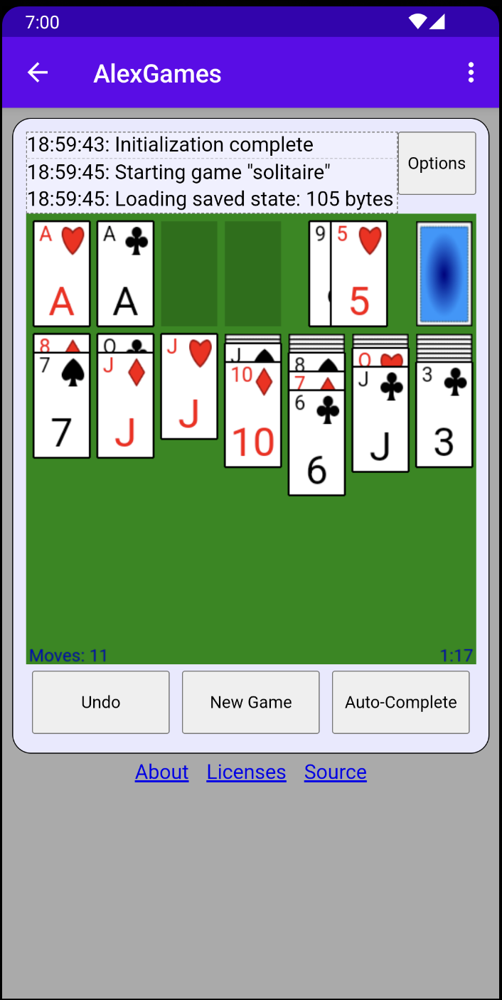
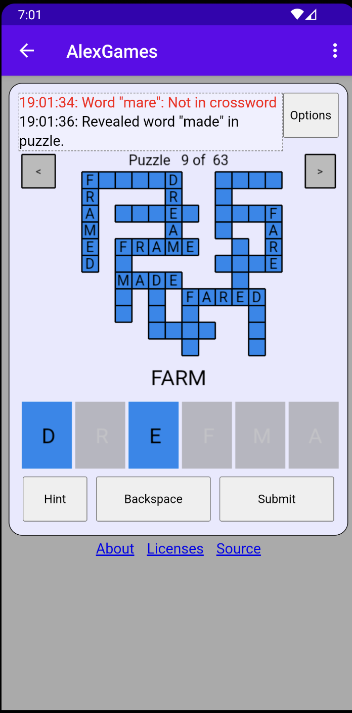
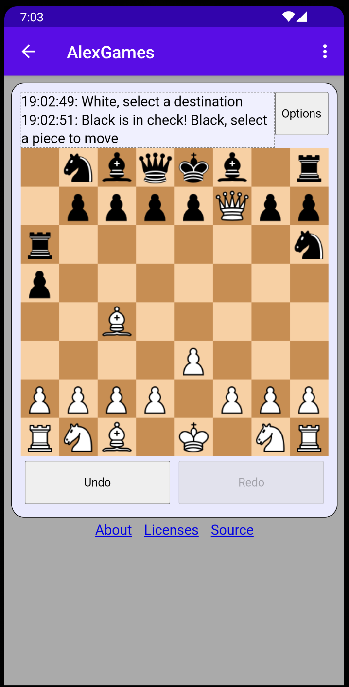

# AlexGames

A collection of simple Lua and Rust games, and an API for playing them including an English dictionary (for word puzzles), websocket multiplayer, state sharing via URL, and auto saving with undo/redo. You can also upload your own Lua games and play in the public web version.

Try the web version here: https://alexbarry.github.io/AlexGames

[](https://f-droid.org/packages/net.alexbarry.alexgames/)

Some games incude:
* [Solitaire](src/lua_scripts/games/solitaire) (Lua)
* ["Word Mastermind"](src/lua_scripts/games/word_mastermind) (Lua): Guess 5 letter words, finding out if you guessed the right letter, or the right letter in the right position.
* [Chess](src/lua_scripts/games/chess) (Lua)
* ["Crossword Letters"](src/lua_scripts/games/crossword_letters) (Lua): Try to make as many words as you can with the letters provided, with a crossword as a hint.
* ["Gem Match"](src/rust_games/gem_match) (Rust): Swap gems to make lines of three or more of the same kind.
* [Go/Weiqi/Baduk](src/lua_scripts/games/go) (Lua)
* [Reversi](src/rust_games/reversi) (Rust)
* [Checkers/Draughts](src/lua_scripts/games/checkers) (Lua)
* ["Endless Runner"](src/lua_scripts/games/endless_runner) (Lua): Tap the screen or press space bar to propel yourself upwards, dodging the endless oncoming obstacles.
* [Minesweeper](src/lua_scripts/games/minesweeper) (Lua)
* [Fluid Mix](src/lua_scripts/games/fluid_mix) (Lua): Rearrange the stacks where you can only move stacks onto empty stacks or stacks of the same colour, until each stack has only a single colour.
* [Backgammon](src/lua_scripts/games/backgammon) (Lua)
* [Cribbage](src/lua_scripts/games/crib) (Lua)
* ["Spider Swing"](src/lua_scripts/games/spider_swing) (Lua): swing from point to point, being careful not to lose too much height or speed.
* ["Thrust"](src/lua_scripts/games/thrust) (Lua): Race your space ship around the track, trying to control your momentum.
* [Gomoku/Wuziqi/Omok](src/lua_scripts/games/go) (Lua): Place stones on a Go board, trying to be the first to create a line of 5.

Screenshots:

<p float="left">



</p>

## Brief technical overview

High level:
* Simple API for handling input/output defined in [`game_api.h`](src/game_api/game_api.h). e.g. "draw rectangle", "handle touch", "send/receive multiplayer message".
* Wrappers to this API for [Lua](src/lua_api/lua_api.c), [Rust](src/rust_games/rust_game_api.rs). (C/C++ can call the API directly).
* Games are written for this API in [Lua](src/lua_scripts/games) and [Rust](src/rust_games). (See the "history browser" (described below) for an example of implementing the game API in C++).
* The API is implemented by the following platforms:
    * web (HTML/JS/WASM): ([C wrapper](src/emscripten/emscripten_api.c), [JS callbacks](src/html/js/alexgames_wasm_api.js), [JS Game APIs](src/html/js/alexgames_wasm_wrapper.js)),
    * [wxWidgets](src/ui_wxWidgets/wx_main.cpp), and
    * Android bundles the web version for offline play, and _(experimental)_ Android supports the native AlexGames API, no browser or WebView required: ([C wrapper](src/android/app/src/main/cpp/alex_games_android_jni.cpp), [Java JNI Interface](src/android/app/src/main/java/net/alexbarry/alexgames/AlexGamesJni.java), [Android canvas writes](src/android/app/src/main/java/net/alexbarry/alexgames/graphics/AlexGamesCanvas.java)).

The web version is polished and fairly robust. The wxWidgets and Android native versions serve more as proof of concepts for now, demonstrating how relatively easy it is to bring up a new platform that supports all the games. But they are lacking some functionality.

Some other cool features:
* Handling arbitrary game uploads: You can write your own Lua game ([see this example Lua game for reference](src/lua_scripts/games/api_demo)), zip it, and upload it to the browser version in the "Options" menu. This doesn't actually send your game over the network, it simply writes it to the Emscripten virtual filesystem on the AlexGames page running in your browser. Then I use libzip to unzip it locally, and treat it similar to the preloaded games. See [`fileReader.onload` in `index.html`](src/html/index.html) for the Javascript web calls, and the C implementation of these APIs can be found in [`game_api.c`](https://github.com/alexbarry/AlexGames/blob/main/src/game_api/game_api.c). (NOTE: this is intended for easily sharing a game with your friends, without having to download and build this repo. But if you are interested in submitting a game then I'd be very happy, see the "Contributing" section in this README)
* [History Browser](src/cpp_libs/history_browse_ui/history_browse_ui.cpp) allows you to view previously saved game states, including a preview. The history browser code itself implements the same API as the games, so it should be easy to support it on a new platform. The history browser code also uses the games' code to render previews, meaning it runs them as games within itself, which is also implementing the game interface.
* [Saved State database](src/cpp_libs/saved_state_db) to keep the API simple, the only persistent state is writing to key value pairs (based on HTML local storage). The "saved state database" is a C++ wrapper to allow games to simply call `save_state` with a `uint8_t` array  every time there is a state change, and the saved state database keeps track of the move ID. It also handles distinguishing between game sessions, and supports undo/redo and loading initial state on game start (e.g. browser refresh).
* _(Experimental)_ [Android web games server](src/android/app/src/main/java/net/alexbarry/alexgames/server): this isn't often a useful feature, but if you had a WiFi network with no public internet access, and IP isolation isn't enforced, you could use a phone with the AlexGames Android app to host the simple static HTTP and websocket server. This would allow you to play games with your friends on your local network, without relying on the public internet.

## How to build

### Using docker

**TL;DR:** you can simply run `sudo docker-compose up --build`, then navigate to http://localhost:1234 . This hosts an HTML server on port 1234, and a websocket server on port 55433. But if you want to host it on a public server, you should build the static HTML separately, copy that to your HTML server content path, and run the websocket server separately (see below).

#### Build and host static HTML/JS/WASM

Run this script to build and run the docker image to build the HTML/WASM implementation. This mounts the project as a volume, so that incremental builds are supported. (NOTE: you will need to remove `build/wasm/out` if you have previously built from outside the docker image.)

```
docker/http_server/build.sh
```

For development purposes, you can host a simple HTTP server like this, on port 1234:
```
docker/http_server/start_http_server.sh
```

Alternatively, copy `build/wasm/out/http_out/*` to your HTTP server path.

#### Build and host the websocket server

For development purposes, from a separate terminal, run this command to host the websocket server:
```
sudo docker build -t alexgames_ws_server -f docker/ws_server/Dockerfile .
sudo docker run -p 55433:55433 -it alexgames_ws_server
```

But for hosting on a public server, assuming you are using SSL (HTTPS), you will need to pass your SSL certs to the websocket server:

```
sudo docker run -p 55433:55433 -it alexgames_ws_server \
	--use_ssl \
	--ssl_fullchain /path/to/your_fullchain.pem \
	--ssl_privkey /path/to/your_privkey.pem
```

#### Try your server

If you ran the command to host the static HTML on port 1234, then simply navigate to http://localhost:1234.

If you copied it to your existing HTTP server, then you should be able to open it now.

### How to build manually

See BUILD.md. I find this much more convenient for incremental builds.

## Matrix Widget

In the branch [`matrix-widget`](https://github.com/alexbarry/AlexGames/tree/matrix-widget), the source has been modified to use the matrix.org widget API for multiplayer messages.

See the "AlexGames" section of ["This Week in Matrix" 2024-09-27](https://matrix.org/blog/2024/09/27/this-week-in-matrix-2024-09-27/#alexgames-simple-lua-rust-webassembly-powered-board-games-running-in-a-matrix-widget) for more information. Here is a demo video:

[](http://www.youtube.com/watch?v=a_uR0tPeR18 "AlexGames chess as a matrix widget")

I'm happy to polish this and merge it into main if there is any interest.

## Contributing

I would be very happy if anyone wants to add their own game, or implement the API on a new platform. Feel free to contact me if you are interested. I would be happy to guide you through the code or investigate any bugs you are running into.

The goal is that both adding a new game or supporting a new platform should be fairly easy.

If you would like to add a new API for your game, then consider briefly discussing it with me first. If it is something that could be handled by the other APIs without much difficulty, a library is preferred. Ideally each platform should have to implement as few APIs as possible.

## Contact

* Email: `alexbarry.dev2 [ at ] gmail.com`.
* Matrix: [`#alexgames:matrix.org`](https://matrix.to/#/#alexgames:matrix.org)
* Github: https://github.com/alexbarry/AlexGames
* Discord: https://discord.gg/rhy8SuHPYU
* Lemmy: [`!alexgames@lemmy.ca`](https://lemmyverse.link/c/alexgames@lemmy.ca)
